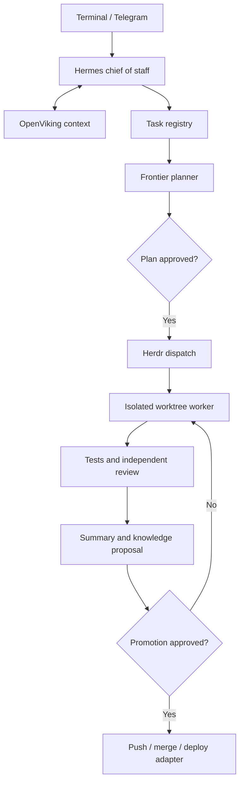

# Self-Contained Agent Company for WSL

## Summary

Build a dedicated Ubuntu 24.04 WSL environment where:

- Hermes is the conversational chief of staff, dispatcher, reminder service, and final synthesizer.
- Herdr manages durable Codex/OpenCode processes, worktrees, terminals, and resumable sessions. [Herdr agents](https://herdr.dev/docs/agents/) [session recovery](https://herdr.dev/docs/session-state/)
- Codex performs frontier architecture, planning, research synthesis, difficult implementation, and critical review.
- OpenCode performs economical implementation using DeepSeek and Gemini.
- OpenViking provides hierarchical retrieval and agent memory from day one, while Git-backed Markdown remains the auditable source of truth. Hermes has a first-class OpenViking integration. [Hermes integration](https://docs.openviking.ai/en/agent-integrations/05-hermes)
- Telegram is added after local validation as a supervised gateway, not an unrestricted remote shell.
- The eventual VPS is rebuilt declaratively from pinned configuration and restored encrypted state.

## Architecture and Interfaces

### Control plane

Implement a small company-control service between Hermes and Herdr. It exposes only:

- `create_task`
- `get_task_status`
- `approve_action`
- `reject_action`
- `cancel_task`
- `capture_note`
- `schedule_reminder`

It must not expose arbitrary host commands.

Use SQLite for current state and append-only JSONL for audit events. Define these stable records:

- `TaskManifest`: task/project IDs, request, acceptance criteria, risk, role, model alias, capability profile, worktree, branch, session IDs, state, approvals, cost, and artifacts.
- `ApprovalRequest`: exact proposed action, scope, reason, expiry, one-use token, and risk class.
- `HandoffPacket`: outcome, changed files, tests, decisions, risks, unresolved questions, diff/commit identifier, and next action.
- `KnowledgeRecord`: record ID, project ID, type, source session, source URI, ledger commit, author/model, confidence, review state, and timestamps.

Use this task lifecycle:

`intake → clarify → plan → approval → worktree → execution → verification → review → summary → promotion approval → complete`

Hermes native delegates are reserved for short-lived reasoning. Persistent Codex and OpenCode workers always run through Herdr because native Hermes delegates remain tied to the owning process/session. [Hermes delegation](https://hermes-agent.nousresearch.com/docs/user-guide/features/delegation)

### Session guarantees

- Assign a task ID before dispatching any worker.
- Correlate Hermes, Herdr, Codex, OpenCode, worktree, Git, model, and knowledge records.
- Preserve native agent session IDs and sanitized exports.
- Resume native sessions after restart when supported; otherwise start from the latest handoff packet.
- Run an orphan-session sweeper after startup and on a schedule.
- Allow only one writing agent per worktree.
- Limit initial concurrency to three workers; parallelize research, exploration, tests, and read-only reviews.

## Agent Roster, Models, and Permissions

Use model aliases rather than hard-coded model names. The production provider pool is OpenAI, DeepSeek, and Gemini.

| Role | Default model | Permissions |
|---|---|---|
| Hermes assistant/router | `deepseek-v4-flash`, non-thinking | Company-control API, OpenViking recall, reminders; no general shell |
| Architect/planner | Codex `gpt-5.6`, high/xhigh | Read-only project and knowledge access |
| Research collectors | `gemini-3.6-flash` or `deepseek-v4-flash` | Read-only files and controlled web access |
| Research synthesizer | Codex `gpt-5.6`, xhigh | Read-only evidence and citation set |
| Routine coder | OpenCode `deepseek-v4-flash`, thinking | Assigned worktree only; network disabled by default |
| Intermediate escalation | OpenCode `deepseek-v4-pro` | Same isolated worktree profile |
| Frontier coder | Codex `gpt-5.6`, high | Used for complex or failed implementation |
| Independent reviewer | `gemini-3.6-flash`, read-only | Diff, tests, requirements, and knowledge context |
| High-risk reviewer | Codex `gpt-5.6`, xhigh | Required for security, auth, migrations, infrastructure |
| Curator/writer | `gemini-3.5-flash-lite` or DeepSeek Flash | Knowledge proposal branch only |
| Scheduled-job narrator | DeepSeek Flash or Gemini Flash-Lite | No shell; consumes deterministic job results |

Current model selection is based on official guidance for [OpenAI models](https://developers.openai.com/api/docs/guides/latest-model), [DeepSeek V4 pricing and capabilities](https://api-docs.deepseek.com/quick_start/pricing), and [Gemini Flash models](https://ai.google.dev/gemini-api/docs/latest-model).

Escalate automatically when:

- Work touches authentication, secrets, deployment, infrastructure, schemas, migrations, or public APIs.
- Requirements remain ambiguous after one clarification pass.
- Tests fail twice.
- The diff exceeds the approved scope.
- A worker requests broader permissions or network access.
- The independent reviewer disagrees with the implementation.
- The user explicitly requests frontier treatment.

Maintain a Git-backed shared skills repository under the agentskills-compatible location. Mount it read-only for workers. Skill changes go through a proposal branch and review. Define role-specific skill allowlists for planning, research, implementation, testing, security review, curation, and personal-assistant work. Both [Codex agent configuration](https://learn.chatgpt.com/docs/agent-configuration/subagents) and [OpenCode agents](https://opencode.ai/docs/agents/) support role-specific models and behavior.

## Platform, Memory, and Security

### WSL foundation

- Create a dedicated Ubuntu 24.04 WSL distro and unprivileged orchestrator account.
- Enable systemd and run Hermes, Herdr, OpenViking, and the control service as user services.
- Store repositories in the Linux ext4 filesystem.
- Disable automatic Windows-drive mounts; add explicit mounts only when required.
- Use rootless containers for OpenCode writers and other write-capable workers.
- Apply Codex workspace-write sandboxing, filtered environments, and network-off defaults. [Codex sandboxing](https://learn.chatgpt.com/docs/sandboxing)
- Encrypt configuration with SOPS and age. Materialize per-service secrets into runtime-only files; never pass all provider or Git credentials to workers.
- Prohibit passwordless sudo, Docker socket access, direct Git push, and deployment credentials inside worker environments.

### Hybrid knowledge ledger

Maintain:

- Central private company-brain repository: portfolio, inbox, reminders, policies, playbooks, personal context, project registry, and session index.
- Project repositories: approved specs, plans, decisions, research, and open questions under a consistent documentation directory.
- Separate encrypted archive: sanitized native transcripts and tool/event records.

All inputs are archived after redaction. Explicit notes and reminders enter the inbox automatically. Session summaries propose changes to requests, decisions, research, specs, plans, and questions. Decisions/specifications require approval before entering canonical branches.

Default retention:

- Redacted raw session archives: 180 days.
- Approved summaries, decisions, and Git history: indefinite.
- Secrets and unredacted command output: never intentionally archived.

### OpenViking

- Run a pinned OpenViking image as a separate rootless service on `127.0.0.1:1933`.
- Require an API key and disable bundled VikingBot.
- Use local storage and vector index.
- Use Ollama-backed local dense embeddings so the complete corpus is not exported to an embedding service. OpenViking officially supports local Ollama embeddings. [OpenViking configuration](https://docs.openviking.ai/en/faq/faq)
- Use DeepSeek V4 Flash for economical memory extraction on sanitized content.
- Index approved ledger commits as project resources.
- Attach project ID, source URI, and Git commit to retrieved context.
- Prevent workers from writing canonical memory directly.
- Verify periodically that the index can be rebuilt from Git and archived summaries.
- Pin and test upgrades because the main OpenViking project is AGPL-3.0 and still evolving. Review licensing before exposing it to third parties.

Honcho becomes a later evaluation candidate for multi-agent/user alignment. Mem0 is not part of the initial system. OpenClaw remains the closest all-in-one alternative, but Hermes plus Herdr better fits durable heterogeneous coding sessions and the chosen knowledge architecture. [OpenClaw multi-agent routing](https://docs.openclaw.ai/multi-agent)

## Rollout

1. **Foundation**
   - Provision the dedicated WSL distro, account, directories, rootless runtime, secrets, networking policy, and user services.
   - Create the central brain and shared-skills repositories.

2. **Local control plane**
   - Install pinned Hermes, Herdr, Codex, and OpenCode versions.
   - Implement the task registry, company-control interface, state machine, approvals, and handoff format.
   - Launch only assistant, planner, routine coder, and verifier roles initially.

3. **Knowledge pipeline**
   - Deploy OpenViking locally.
   - Implement transcript sanitization, summary generation, hybrid-ledger proposals, indexing, citations, retention, and encrypted backups.
   - Add nightly summaries, daily inbox triage, weekly portfolio digest, reminder execution, orphan recovery, and cost reports.

4. **Model evaluation and roster expansion**
   - Benchmark DeepSeek Flash, DeepSeek Pro, Gemini Flash, Gemini Flash-Lite, GPT-5.6 Luna, and GPT-5.6 on representative local tasks.
   - Retain aliases so models can be changed without editing role definitions.
   - Add specialist skills only after corresponding permission and evaluation tests pass.

5. **Telegram pilot**
   - Use outbound long polling and an allowlist of Telegram user IDs.
   - Support task creation, status, notes, reminders, cancellation, and scoped approvals.
   - Use signed, expiring, one-use approval tokens.
   - Never accept arbitrary shell text as a privileged command.

6. **VPS migration**
   - Rebuild on Ubuntu 24.04 using pinned declarative configuration.
   - Restore encrypted Git repositories, registry, archives, and OpenViking state.
   - Restrict administration to SSH keys over Tailscale or an equivalent private overlay.
   - Keep Herdr, OpenViking, dashboards, sockets, and agent endpoints off the public internet.
   - Perform a full restore drill before switching Telegram to the VPS.

## Test and Acceptance Plan

- Create both a new project and a task against an existing project through Hermes.
- Confirm planning is read-only and execution cannot begin without approval.
- Confirm the coder can modify only its assigned worktree and cannot push, read unrelated projects, access secrets, or enable network access.
- Verify deterministic tests run before LLM review.
- Kill workers and restart WSL; confirm tasks resume or recover from handoff packets without losing correlation.
- Simulate provider failures and verify alias-based fallback and cost tracking.
- Reject path traversal, symlink escape, prompt-injection, approval replay, unauthorized Telegram users, and destructive shell requests.
- Ask a cross-project question and require OpenViking results to cite the correct project resource and ledger commit.
- Rebuild the OpenViking index solely from Git and sanitized archives.
- Restore all state into a clean environment and compare task, knowledge, and session inventories.
- Complete a 14-day local soak covering at least 25 tasks across two projects with no lost sessions or unauthorized state changes before enabling Telegram.
- Promote a cheap model only when it completes the representative evaluation suite without unauthorized changes, achieves at least 90% of the frontier baseline success rate, and materially reduces cost.
- Require explicit user approval for every push, merge, deployment, secret access, destructive action, privilege change, or scope expansion.

## Assumptions and Defaults

- Telegram uses supervised control because no alternative authority level was selected.
- Projects use Git and can be cloned into the WSL Linux filesystem.
- The user supplies provider, Git remote, Telegram, backup-repository, and VPS credentials.
- The initial backup implementation uses encrypted Restic storage through a configurable S3-compatible endpoint.
- No automatic merge, deployment, public dashboard, unrestricted shell gateway, or large autonomous swarm is included.
- Langfuse may be added after the task registry is stable for self-hosted trace analysis; it does not replace the project ledger or session archive.
